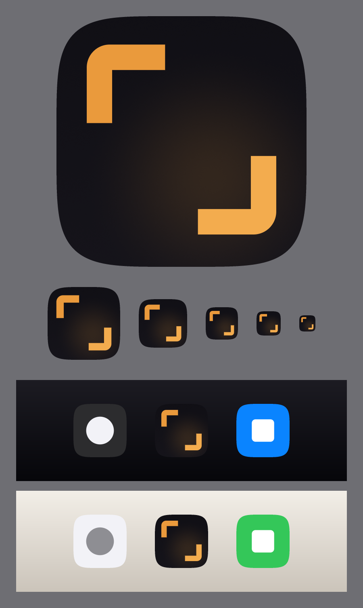
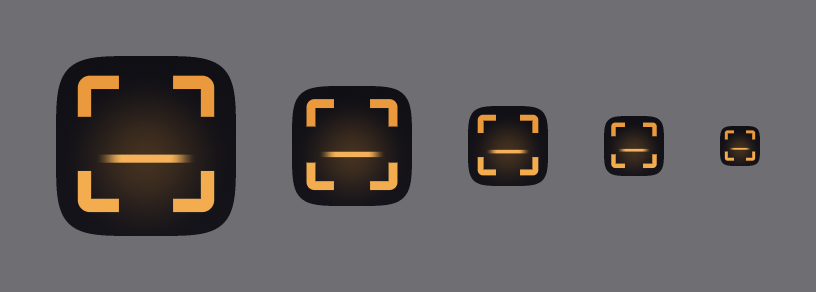
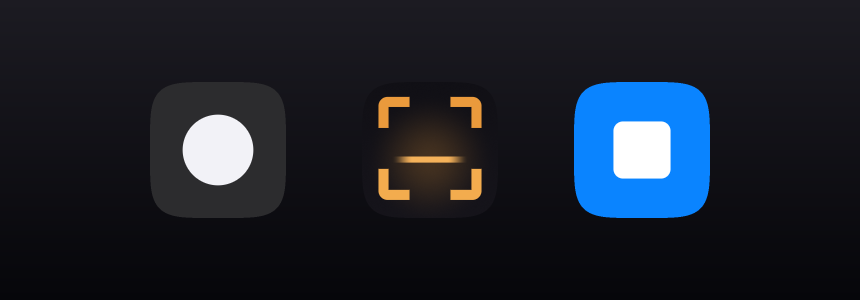
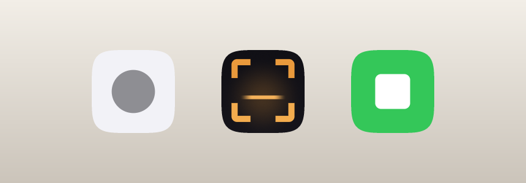

# 뷰파인더 앱 아이콘 — Framed Horizon



## 콘셉트

뷰파인더 브래킷 네 개가 **골든아워의 빛 한 줄기**를 감싼다.

프레임만 놓으면 그건 뷰파인더, 즉 카메라다. 뷰파인더는 카메라 앱이 아니라
**촬영할 장소와 순간을 찾는 앱**이므로, 프레임 안에 무엇을 담는지가 앱의 정체다.

- 프레임 = 사진
- 빛의 띠 = 장소(세상 속의 어딘가)이면서 동시에 시간(낮게 걸린 골든아워)

빛은 끝이 없다. 양쪽으로 사라지듯 페이드된다. 그래서 "그려진 선"이 아니라
**장면을 가로지르는 빛**으로 읽힌다. 끝을 딱 끊으면 입력 필드나 빼기 기호처럼 보인다.

의도적으로 배제한 것: 카메라 렌즈, DSLR 실루엣, **산과 해**, 위치 핀, 지도 마커,
풍경 일러스트, `VF` 레터마크, 3D 그래픽. 지평선은 있지만 땅덩어리도 태양 원반도 없다.

## 지오메트리

1024×1024 디자인 공간 기준. 모서리 라운드는 굽지 않는다(iOS가 자체 마스크를 적용).

| 항목 | 값 |
|---|---|
| 프레임 | 700 × 700, 중심 `(512, 500)` |
| 브래킷 | 4코너, 스트로크 76px |
| 팔 길이 | 196px (프레임 변의 28%) |
| 코너 반경 | 30px (중심선) → 외곽 68 |
| 캡 | 플랫 (butt) |
| 빛의 띠 | `y = 584`, `x = 224 → 800`, 두께 46px |
| 빛의 페이드 | 양끝 각 28% 구간이 0까지 smoothstep |

빛의 띠는 프레임 하단 1/3 근처에 놓인다. 풍경 사진에서 지평선을 두는 위치다.

## 컬러

| 역할 | 값 | 비고 |
|---|---|---|
| 배경 베이스 | `#131218` | |
| 수직 베일 | `#0D0C11` → `#18161D` @ 42% | 미세 깊이 |
| 골든아워 블룸 | `#F0A03C` 22% → 0%, radial `(512, 584)` r500 | 경계 없음 |
| 빛의 띠 | `#F5B25A` | 가장 밝은 요소 |
| 브래킷 (상단) | `#EA9A3C` | 광원 반대편 |
| 브래킷 (하단) | `#F3AC4E` | 광원 쪽, 명도차 9% |
| 브랜드 앰버 | `#F0A03C` | 위 값들의 기준점 |

광원은 빛의 띠 자체다. 블룸이 거기서 퍼지고, 하단 브래킷이 상단보다 밝다.
그라디언트는 배경 블룸, 빛의 띠 페이드, 브래킷 간 9% 명도차 — 이 세 곳에만 쓴다.

## 검증

### 실제 크기 — 180 / 120 / 80 / 60 / 40px



40px에서도 프레임과 빛이 모두 남는다. 스트로크 76px은 40px 렌더에서 약 3px이다.

### 홈 화면




이웃은 비교용 더미다. 라이트 배경에서는 어두운 타일 자체가 대비를 만든다.
다크 배경에서는 빛의 띠가 발광체처럼 읽혀 존재감을 만든다.

### Tinted / 단색 모드


iOS Tinted 아이콘은 휘도만 사용한다. 빛의 띠가 가장 밝은 값이라 단색에서도 구조가 유지된다.

### 프레임만 있을 때와의 비교 — 60px 확대


왼쪽이 프레임만 있는 초기안, 오른쪽이 채택안.
왼쪽은 "카메라 앱"으로 읽히고 장소도 시간도 없다. 프레임 안에 빛을 넣은 것이 이 아이콘의 핵심 결정이다.

### 탐색 과정

`explore/` 폴더에 결정 근거가 남아 있다.

| 파일 | 내용 |
|---|---|
| [`subject-study.png`](explore/subject-study.png) | 프레임 안에 무엇을 넣을지 5안 비교 |
| [`v3-refinement.png`](explore/v3-refinement.png) | 빛의 띠 폭·위치·끝 처리 5안 비교 |
| `v0~v4-1024.png` | 각 안의 1024 렌더 |

탈락한 안과 이유:

- **프레임 + 점** — 점이 오토포커스 마크로 읽혀 오히려 더 카메라 같았다
- **대각 하프 프레임 + 수평선** — 선이 브래킷과 정렬되지 않아 떠 보였다
- **프레임 + 지평선 + 태양** — 해가 선에 얹혀 저울처럼 보이고, 여행 앱 클리셰로 기울었다
- **끝이 딱 끊긴 지평선** — 빛이 아니라 그려진 자(rule)로 읽혔다
- **타일 끝까지 닿는 지평선** — 아이콘을 반으로 가르는 빼기 기호처럼 보였다

## 알려진 리스크

빛의 띠가 카메라의 수평 표시(레벨 인디케이터)로 읽힐 수 있다. 다만 이건 사진 도구의
언어이므로 브랜드에서 벗어나지 않는다. 블룸이 띠를 발광체로 만들어 UI 요소와 구분한다.

**빛의 띠는 프레임 안에 확실히 갇혀 있어야 한다.** 타일 가장자리까지 늘리면 아이콘이
둘로 갈라지고, 페이드를 없애면 그려진 선이 된다. 이 두 가지가 이 아이콘의 핵심 변수다.

## 확장

프레임과 빛, 두 요소로 브랜드 시스템이 파생된다.

- 사진 카드 오버레이 — 브래킷이 사진을 감싼다. "뷰파인더가 프레이밍한 장소"
- 맵 마커 — 핀 대신 브래킷이 장소를 감싼다. 위치 핀 클리셰를 브랜드로 대체
- 골든아워 UI — 빛의 띠를 시간 슬라이더·일몰 인디케이터의 시각 언어로
- 공유 이미지 워터마크 — 네 코너만 얹어도 출처가 읽힘
- 앱 실행 모션 — 브래킷이 바깥에서 스냅되고 빛의 띠가 번지며 나타남

## 재생성

```bash
python3 Tools/AppIcon/export_all.py
```

의존성 없음. `Tools/AppIcon/gen_icons.py`가 SDF 기반 벡터 래스터라이저와 PNG 인코더를
직접 구현한다. 모든 사이즈는 비트맵 축소가 아니라 각 해상도에서의 독립 벡터 렌더다.

지오메트리를 바꾸려면 `gen_icons.py`의 `spec_framed_horizon()` 기본값을 수정한다.

| 인자 | 의미 |
|---|---|
| `stroke` | 브래킷 두께 |
| `frame` | 프레임 크기 |
| `arm_ratio` | 팔 길이 비율 |
| `radius_ratio` | 코너 반경 (스트로크 대비) |
| `horizon_y` | 빛의 띠 높이 |
| `horizon_w` | 빛의 띠 두께 |
| `horizon_x` | 빛의 띠 좌우 범위 |
| `horizon_soft` | 양끝 페이드 비율 |
| `bloom_peak` | 골든아워 빛의 세기 |

탐색용 스크립트: `explore_subjects.py`(프레임 안 대상 5안), `refine_v3.py`(빛의 띠 5안).

벡터 원본: [`app-icon.svg`](app-icon.svg)
