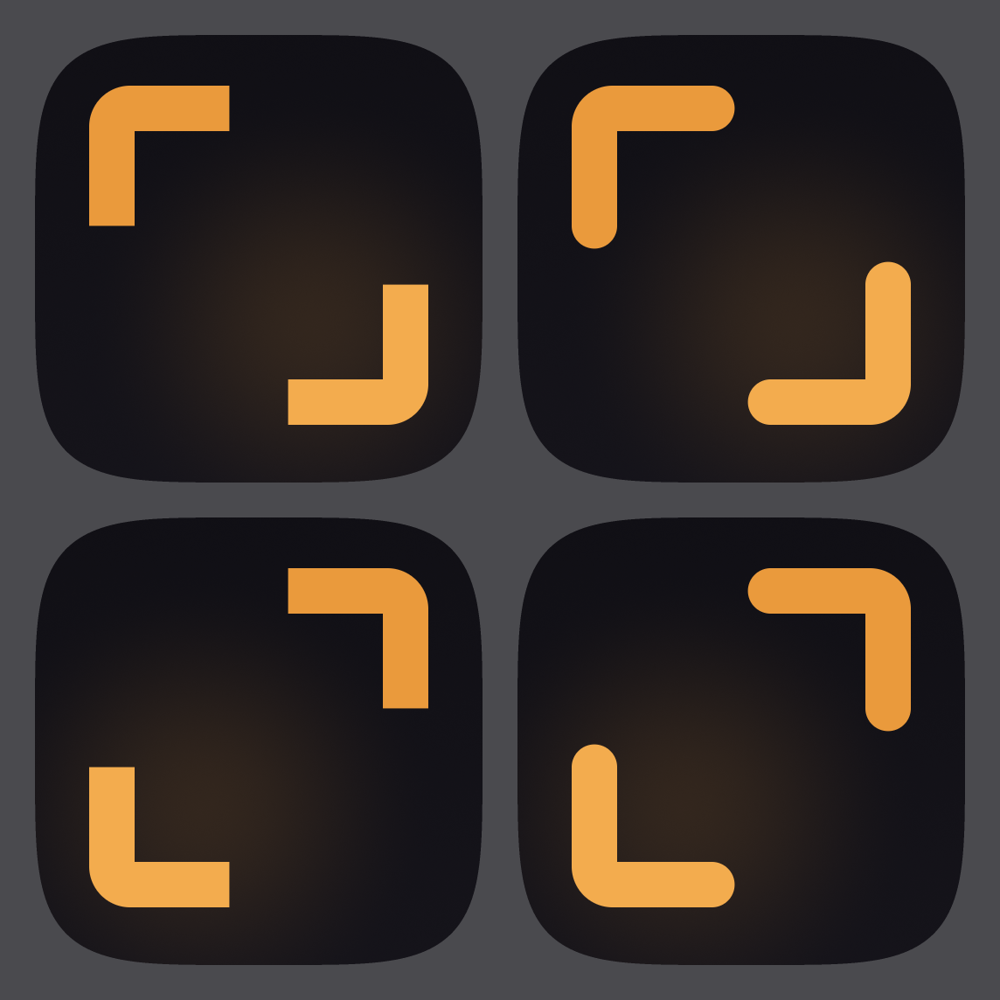

# 뷰파인더 앱 아이콘 — Half Frame


## 콘셉트

뷰파인더 브래킷 두 개를 대각으로 마주 놓았다. **프레임을 일부러 닫지 않았다.**

닫힌 프레임은 이미 찍은 사진, 즉 결과물이다. 열린 프레임은 아직 찍지 않은 상태, 즉 탐색이다.
뷰파인더는 촬영 앱이 아니라 촬영할 장소와 순간을 찾는 앱이므로, 프레임을 반만 닫는다.

가운데 비어 있는 대각 공간이 "세상"이고, 우하단으로 골든아워의 온기가 경계 없이 옅게 깔린다.
빛은 형태를 갖지 않는다 — 태양 원반을 그리는 순간 여행 앱이 되기 때문이다.

의도적으로 배제한 것: 카메라 렌즈, DSLR 실루엣, 산과 해, 위치 핀, 지도 마커, 풍경 일러스트, `VF` 레터마크, 3D 그래픽.

## 지오메트리

1024×1024 디자인 공간 기준. 모서리 라운드는 굽지 않는다(iOS가 자체 마스크를 적용).

| 항목 | 값 |
|---|---|
| 암시된 프레임 | 672 × 672, 중심 `(512, 504)` — 8px 광학 상향 |
| 브래킷 | 좌상단 `┌` + 우하단 `┘`, 2개 |
| 스트로크 두께 | 104px |
| 팔 길이 | 269px (프레임 변의 40%) |
| 코너 반경 | 42px (중심선) → 외곽 94 / 내곽 샤프 |
| 캡 | 플랫 (butt) |
| 각 변의 빈 구간 | 403px |
| 앰버 면적 | 캔버스의 10.7% |

## 컬러

| 역할 | 값 | 비고 |
|---|---|---|
| 배경 베이스 | `#131218` | |
| 수직 베일 | `#0D0C11` → `#18161D` @ 42% | 미세 깊이 |
| 골든아워 블룸 | `#F0A03C` 14% → 0%, radial `(640, 660)` r540 | 경계 없음 |
| 브래킷 (상단) | `#EA9A3C` | 광원 반대편 |
| 브래킷 (하단) | `#F3AC4E` | 광원 쪽, 명도차 9% |
| 브랜드 앰버 | `#F0A03C` | 위 두 값의 기준점 |

광원은 우하단 단일. 석양은 낮게 오므로 블룸·브래킷 명도·대각 개구부 방향이 모두 같은 축을 공유한다.
그라디언트는 배경 대기와 브래킷 간 9% 명도차, 이 두 곳에만 쓴다.

## 검증

### 실제 크기 — 180 / 120 / 80 / 60 / 40px


40px에서도 두 브래킷의 형태가 남는다. 스트로크 104px은 40px 렌더에서 약 4px로, 홈 화면 최소 가독 두께를 확보한다.

### 홈 화면


이웃은 비교용 더미다. 라이트 배경에서는 어두운 타일 자체가 대비를 만들어 가장 강하다.
다크 배경에서는 이웃보다 조용하지만 이건 의도다 — 사진 앱이 홈 화면에서 가장 시끄러우면 안 된다.

### Tinted / 단색 모드


iOS Tinted 아이콘은 휘도만 사용한다. 오브젝트가 브래킷 2개뿐이라 형태 손실이 없다.

### 대안 비교 — 60px 확대


왼쪽이 채택안(Half Frame), 오른쪽이 탈락안(Golden Aperture, 4코너 + 중앙광).
Golden Aperture는 1024에서 더 예쁘지만 축소되면 "테두리 + 후광"이라는 스캐너 아이콘 원형으로 수렴한다.

### A/B 변수



플랫 캡 vs 라운드 캡 × `TL-BR` vs `TR-BL`. 채택: **플랫 캡 + TL-BR** (좌상단 우하단).
플랫 캡은 정밀 기구 느낌을 주고 라운드 캡의 물러 보이는 인상을 피한다.

## 알려진 리스크

Photoshop과 Figma의 crop 툴 아이콘이 두 개의 L자다. 다만 crop 툴은 두 L이 **겹쳐서 사각형을 만들고**,
이 마크는 두 L이 403px 떨어져 있으며 앰버 단색이고 다크 필드 위에 있다. 겹침 여부가 "편집 도구"와 "발견 도구"를 가른다.
두 브래킷 사이 간격은 이 아이콘의 핵심 변수이므로 좁히지 말 것.

## 확장

브래킷 페어 하나로 브랜드 시스템 전체가 파생된다.

- 사진 카드 코너 오버레이 — "뷰파인더가 프레이밍한 장소"
- 맵 마커 — 핀 대신 브래킷이 장소를 감싼다. 위치 핀 클리셰를 브랜드로 대체
- 공유 이미지 워터마크 — 두 코너만 얹어도 출처가 읽힘
- 앱 실행 모션 — 브래킷이 바깥에서 스냅되어 자리 잡음 (포커스 락)
- 저장/북마크 상태, 빈 상태, 온보딩

## 재생성

```bash
python3 Tools/AppIcon/export_all.py
```

의존성 없음. `Tools/AppIcon/gen_icons.py`가 SDF 기반 벡터 래스터라이저와 PNG 인코더를 직접 구현한다.
모든 사이즈는 비트맵 축소가 아니라 각 해상도에서의 독립 벡터 렌더다.

지오메트리를 바꾸려면 `gen_icons.py`의 `spec_half_frame()` 기본값을 수정한다.

- `stroke` — 브래킷 두께
- `frame` — 암시된 프레임 크기
- `arm_ratio` — 팔 길이 비율
- `radius_ratio` — 코너 반경 (스트로크 대비)
- `bloom_peak` — 골든아워 빛의 세기

벡터 원본: [`app-icon.svg`](app-icon.svg)
